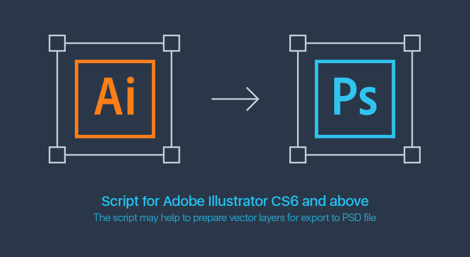
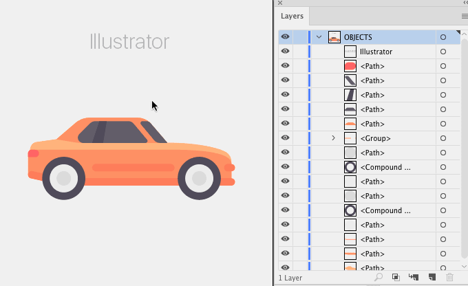

# Ai-to-Psd v1.3
**New update v1.3: fixed a Overprint Fill issue.** With the option enabled, the object was rasterized when exporting

## Description
The script may help to prepare vector layers for export from AI to PSD file.  
All **solid filled** objects remain vector in the PSD.

## Installation 

1. [Download archive] and unzip
2. Place `ai-to-psd.jsx` in the Illustrator Scripts folder:
	- OS X: `/Applications/Adobe Illustrator [version]/Presets.localized/en_GB/Scripts`
	- Windows (32 bit): `C:\Program Files (x86)\Adobe\Adobe Illustrator [version]\Presets\en_GB\Scripts\`
	- Windows (64 bit): `C:\Program Files\Adobe\Adobe Illustrator [version] (64 Bit)\Presets\en_GB\Scripts\`
3. Load `Ai-to-Psd.aia` action file by `Window → Actions → Load Actions… `
5. Restart Illustrator

[Download archive]: https://github.com/creold/ai-to-psd/archive/master.zip 

## Usage 

If you want to save the vector stroke in the PSD, then you have to select the object and use `Object → Path → Outline Stroke`. 

If you have a large group of small objects, e.g. hair brush draws, fur or outlined text, it'd be better to combine such elements into the `Compound Path with Object → Compound Path → Make` before the script is executed. 

1. Open document in Adobe Illustrator
2. Choose `File → Scripts → ai-to-psd`
3. Wait for the message of completion
4. Export the file to PSD via `File → Export → Export As...`

*Attention: Meshes, objects with a gradient fill, pattern, various strokes, Open Path can not be left as vectors after the export, but they are automatically grouped to be separate raster layers in the PSD.*

## System Requirements

Should work with Adobe Illustrator CS6 and higher.   
The script has been tested on Illustrator CS6 (Win), Illustrator CC 2017 (OS X El Capitan).

## Release notes 

| Version | Notes |
| --- | --- |
| **v1.3** | Fixed a Overprint issue. |
| **v1.2** | Fixed a performance issue. |
| **v1.1** | The script unlocks visible layers & objects before and the do the rest. |
| **v1.0** | Initial Version. | 

### Donate (optional)
Buy me a glassful of fresh juice to give me work energy: [pay $1 by PayPal] or [Yandex Money] 🙂

[pay $1 by PayPal]: https://paypal.me/osokin/1usd
[Yandex Money]: https://money.yandex.ru/to/410011149615582

### Feedback & Help

Found a bug? Please [submit a new issues](https://github.com/creold/ai-to-psd/issues) here on GitHub.

### Authors profiles
Radmir Kashaev: [GitHub](https://github.com/rkashaev)  
Sergey Osokin: [Behance](https://behance.net/creold) 

### License

Ai-to-Psd is licensed under the MIT licence.  
See the included LICENSE file for more details.