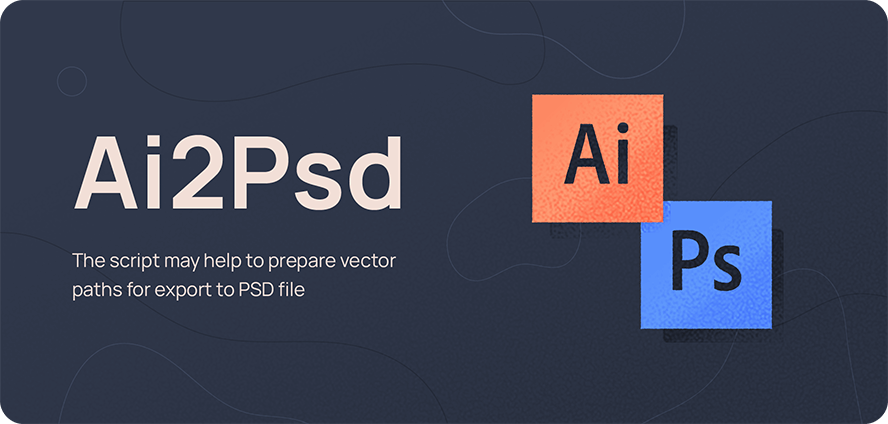
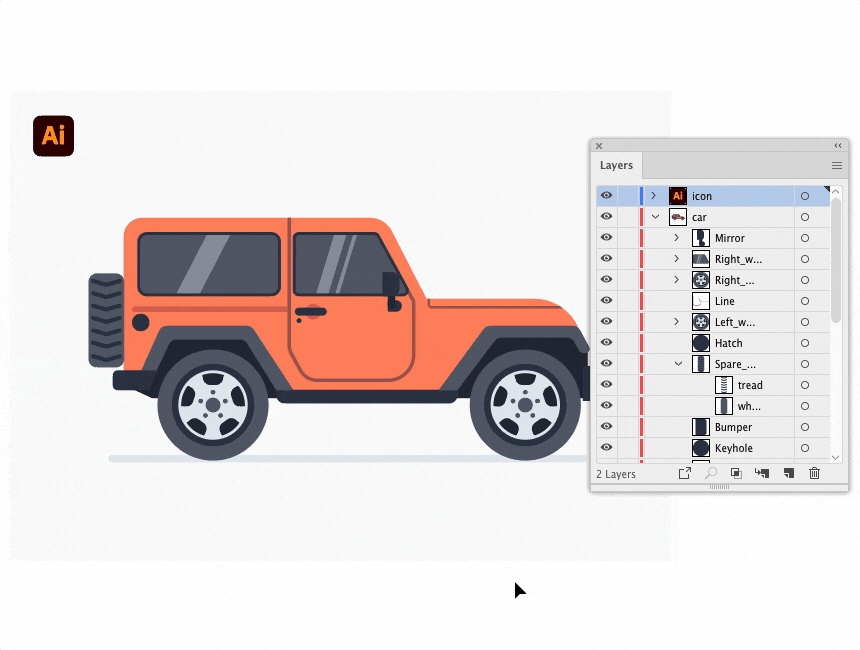
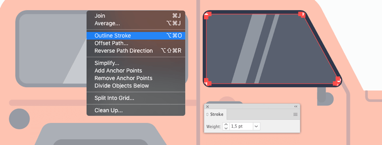
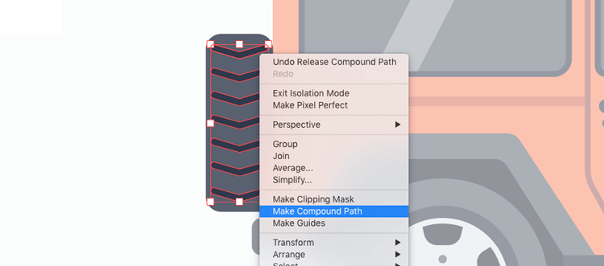

# Ai2Psd v4.0
  

## Description
The Ai2Psd script may help to prepare vector layers for export from AI to PSD file.

#### Export   

| Object | Support | Format |
| --- | --- | --- |
| Basic shapes | YES | Editable |
| Path shapes | YES | Editable |
| Groups | YES | Editable |
| Text | YES | Editable |
| Fills | YES | Editable |
| Clipping Paths | YES | Editable |
| Gradients | NO | Rasterized |
| Strokes | NO | Rasterized |
| Filter Effects | NO | Clear |

*P.S. Some layers in the PSD could get merged randomly...in Adobe CC 2023 there's still no reliable way to control it. We tried!*

> **Warning**   
> You must have the Layers panel shown and expanded on the screen for the script to work properly.   
> 
> The script makes changes to the opened file, so it is better to copy and run it.   
> 
> You can't rerun the script on a file that has already been processed. First, use `File → Revert` to revert to the previously saved state.

#### Blog Article

En: [How to export an Illustrator file into a vector layered Photoshop file](https://medium.com/@creold/how-to-export-a-illustrator-file-into-a-vector-layered-photoshop-file-2dcc274abf66)   
Ru: [Экспортируем векторные слои из AI в PSD](http://sergosokin.ru/blog/export-vector-ai-to-psd/)

#### System Requirements

Should work with Adobe Illustrator CS6 and later.   
The script has been tested on Illustrator CS6 (Windows 7), Illustrator CC 2017-2023 (Windows 10, Mac OS).

## News 
March 2023   
**Version 4.0**: 

* New UI with batch export
* Minor improvements

October 2020   
**Version 3.0**: 

* Algorithm issues fixed
* Saving custom path names
* Russian localization

## How to run script

#### Variant 1 — Install 

1. [Download archive] and unzip. All scripts are in the folder `jsx`
2. Place `Ai2Psd.jsx` in the Illustrator Scripts folder:
	- OS X: `/Applications/Adobe Illustrator [vers.]/Presets.localized/en_GB/Scripts`
	- Windows (32 bit): `C:\Program Files (x86)\Adobe\Adobe Illustrator [vers.]\Presets\en_GB\Scripts\`
	- Windows (64 bit): `C:\Program Files\Adobe\Adobe Illustrator [vers.] (64 Bit)\Presets\en_GB\Scripts\`
3. Restart Illustrator

[Download archive]: https://github.com/creold/ai-to-psd/archive/master.zip

#### Variant 2 — Drag & Drop
Drag and drop the script file (JS or JSX) onto the tabs of Illustrator documents. If you drag it to the area of the open document, the script may not work correctly (Adobe bug).  

#### Variant 3 — Use extension
I recommend the [Scripshon Trees] panel. In it you can specify which folder your script files are stored in.

[Scripshon Trees]: https://exchange.adobe.com/creativecloud.details.15873.scripshon-trees.html

> **Warning**   
> To run scripts via the F1-F15 hotkeys, users add them to the Actions panel. Don't add Ai2Psd to the Action, it will cause Illustrator to freeze.

## How to use Ai2Psd
1. Open document(s) in Adobe Illustrator or go next step
2. Choose `File → Scripts → Ai2Psd`
3. Choose  settings
4. Click the Export button
4. Wait for completion

> **Note**   
> If the Ai document is not saved, the PSD is exported to the desktop.   

> **Note**   
> On low-spec computers, I recommend switching Illustrator to full screen mode to speed up the script.   

   

*[Car Vectors by Vecteezy]*

[Car Vectors by Vecteezy]: https://www.vecteezy.com/free-vector/car

## Document Optimization
### Strokes
If you want to save the vector stroke in the PSD, then you have to select the object and use `Object → Path → Outline Stroke`.   

### Similar paths
If you have a large group of small objects, e.g. hair brush draws, fur or outlined text, it'd be better for the to combine such elements into the Compound Path with `Object → Compound Path → Make` before the script is executed.   

> **Note**   
> Meshes, objects with a gradient fill or Spot color, pattern, various strokes can't be left as vectors after the export, but they will be separate raster layers in the PSD file.

### Testimonials   
* Mateusz Nowak: “Thanks for Ai-to-Psd script!”   
* Dilyana Aleksandrova: “ai to psd saved my ass at work man, thank you for sharing it!”   
* Weyn Cueva: “This is amazing! I’ve been looking for something similar because I work more in Photoshop. Thank you.”  
* Maggie Stilwell: “This is awesome! A great timesaver. Thank you for sharing it.”   
* datenshi_blue: “It is a great script, i downloaded it to and i love it”   
* Michael Helmrich: "This is really powerful! Thank you for sharing"

## Donate
You can support my work on new scripts via [Buymeacoffee], [Tinkoff], [ЮMoney], [Donatty], [DonatePay].   

[Buymeacoffee]: https://www.buymeacoffee.com/osokin
[Tinkoff]: https://www.tinkoff.ru/rm/osokin.sergey127/SN67U9405/
[ЮMoney]: https://yoomoney.ru/to/410011149615582
[Donatty]: https://donatty.com/sergosokin
[DonatePay]: https://new.donatepay.ru/@osokin

## Changelog 
| Version | Notes |
| --- | --- |
| **v4.0** | Added UI with batch export. Minor improvements. |
| **v3.0** | Algorithm issues fixed. Added: Saving custom path names, Russian localization. |
| **v2.3** | Minor issues fixed. |
| **v2.2** | Added progress bar and timer. |
| **v2.1** | Fixed unlock and order of objects issue. |
| **v2.0** | The script doesn't need to load the helper Action file. |
| **v1.3** | Fixed Overprint issue. |
| **v1.2** | Improved preformance. |
| **v1.1** | The script unlocks visible layers & objects before and the do the rest. |
| **v1.0** | Initial Version. |

## Contribute

This script is in active development.  
Found a bug? Please [submit a new issues](https://github.com/creold/ai-to-psd/issues) on GitHub.

### Contact
Email <hi@sergosokin.ru>  

### Co-author
Radmir Kashaev: [GitHub](https://github.com/rkashaev)  

### License

Ai-to-Psd is licensed under the MIT licence.  
See the included LICENSE file for more details.